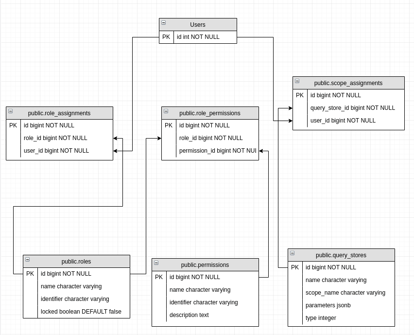

---
author(s):
  - İrfan Subaş (@isubas)
---

Yetkilendirme
=============



Temel Bilgiler
--------------

Sistem üzerinde kullanıcıların erişebileceği işlevleri belirlemek ve sınırlandırmak için üç temel bileşen kullanılarak
yetkilendirme yapısı oluşturulmuştur. Bu bileşenler;

### İzinler (Permissions)

Belirli bir kapsamda yapabilecek işler için oluşturulan genel bir tanımlayıcıdır. İzinler built-in olarak oluşturulur ve
sistem tarafından sunulan interface sayesinde kullanıcıların ilgili izne sahiplikleri sorgulanabilir. (Bknz: User Modeli
Üzerinden Yetki ve Rol Sorgulama) Örneğin, sistem üzerinde dersler ile ilgili işlevleri yapabilmek için
`course_managemant` adında bir izin tanımlanabilir. İzin tanımlamaları, ihtiyaçlara özgü olarak `ders_olusturma_izni`
şeklinde daha spesifik tanımlanabilir. Bu tanımlamalar yetkilendirme ihtiyaçlarına göre geliştiriciler tarafından
belirlenebilir.

### Rol (Role)

İzinlerin gruplandırılarak kullanıcılara atanabilmesini sağlayan bileşendir. Kullanıcı ile izinler arasındaki bağlantı
kullanıcı-rol ilişkisi ile sağlanır. Yukarıda belirtilen görevi dışında diğer bir görevi ise kullanıcılar arasındaki üst
seviyeli yetki ayrımını sağlamaktır. Üst seviyeli yetki ayrımından kasıt `Super Admin`, `Admin`, `Authorization
Manager`, `Student` ve `Lecturer` gibi roller ile üst seviye erişim sınırlamalarını belirlemektir.

### Kapsamlar (Scopes)

Kapsam, sistem üzerinde dinamik olarak veri erişim kısıtlanması sağlayan bileşendir. Web arayüzünde oluşturulan formlar
kullanılarak kapsamlar için sorgulama parametreleri oluşturulur. Bu parametreler `QueryStore` adından bir modelde
tutulmaktadır. Oluşturulan kapsam sorgu parametreleri kullanıcılar ile ilişkilendirilerek, kullanıcıların veri
erişimleri kısıtlanır. (Bknz: Kapsam Oluşturması ve Kullanımı)

Yetkilendirme Alt Yapısı
------------------------

### İşlev Erişim Kısıtlaması

Rol ve izin bazlı yetkilendirme yönetimi için `Pundit` gemi kullanılmıştır.


### Kapsam Oluşturması ve Kullanımı

`Unit` modeli için kapsam oluşturma örneği üzerinden anlatılacaktır.

``` ruby
# unit_scope.rb

# frozen_string_literal: true

class UnitScope < Patron::Scope::Base
  filter :name
  filter :unit_type_id, collection: -> { UnitType.all },
                        multiple: true,
                        i18n_key: :unit_type

  filter :unit_status_id, collection: -> { UnitStatus.all },
                          i18n_key: :unit_status

  preview_attributes :name, :names_depth_cache, :code


  def bypass?
    user.role?(:admin)
  end
end
```

1. `app\scopes` dizini altına `unit_scope.rb` adından bir dosya oluşturulur.

2. `unit_scope.rb` dosyasına `UnitScope` adından ve `Patron::Scope::Base` sınıfından miras alan bir sınıf oluşturulur.
   Oluşturulan kapsam sınıfı için isimlendirmeler `%<KapsamOlusturlanModelAdı>sScope` kuralı göre yapılır.

3. Oluşturulan `UnitScope` sınıfına `Patron::Scope::Base` sınıfından gelen `filter`, `preview_attributes` ve `bypass?`
   metodları kullanılarak gerekli tanımlamalar yapılır. İlgili metodların işlevleri aşağıdaki gibidir;

**filter**

Unit modelinde bulunan niteliklerden hangisinin kapsam sorgu üretiminde kullanılacağını belirlemek için kullanılan
metoddur. Bu metodun kullanım şekli ve alabileceği parametreler aşağıdaki gibidir.

```ruby
  filter :attribute_name, collection: [],  # opsiyonel
                          multiple: false, # opsiyonel
                          i18n_key: :key   # opsiyonel
```

- **attribute_name:** Kapsam oluşturulan modelde filtrelenecek niteliğin adı, bu nitelik sorgulanabilir olmalıdır.

- **collection:** UI üzerinde filtre değeri için oluşturulan input'un `selectbox` türünde olmasını ve selectbox
  listesindeki değerlerin collection'a tanımlanan değerlerden oluşmasını sağlayan parametredir. Bu parametreye verilen
  değer `Proc` sınıfına ait olmalıdır. Eğer `collection` tanımlanmaz ise filtre değeri için oluşturulan input `string`
  türünde olacaktır.

- **multiple:** UI üzerinde filtre değeri için oluşturulan input'un `selectbox` olması durumunda liste üzerinden birden
  fazla değer seçimi yapılabilmesini sağlayan parametredir. `true` veya `false` olmak üzere iki değerden birini alır.
  `true` olması durumundan çoklu seçim aktifleştirilmiş olur.

- **i18n_key:** UI üzerinde filtre ile ilgili çevirilerde kullanılacak anahtar kelimenin belirlenmesi sağlayan
  parametredir. Boş geçilmesi halinde `i18n_key` filtre tanımlanan nitelik adıyla aynı olur. Örnek üzerinden de
  belirtecek olursak filtre niteliği `unit_type_id` iken çevirilerde kullanılacak anahtar kelime `unit_type` olarak
  belirlenmiştir. Ek olarak filtreler için çeviriler `activerecord.attributes.model` kapsamı altında aranır.

**preview_attributes** Ön izleme sırasında hangi niteliklerin görüntüleneceğinin belirlenmesini sağlayan metoddur. Eğer
`preview_attributes` tanımlanmamışsa, `preview_attributes` olarak filtreler kullanılır.

**bypass?** Hangi durumlarda kapsamın bypass edileceğinin belirlendiği metoddur. Bu metod yardımıyla belirli rollere
veya koşullara sahip kullanıcılar için veri sınırlaması bypass edilebilir. Metod içisinde kapsamın uygulandığı
kullanıcıya `user` niteliğiyle erişilir. Bu metodun `true` veya `false` bir değer döndürmesi gerekmektedir.

4. `Unit` modeline `Patron::Scope::Model` modülü `include` edilir. Bu modülün iclude edilemesi ile modele `scope_for`
   adından bir class metod eklenmiş olur. Model için veri sınırlaması bu metod aracılığıyla yapılmaktadır.

```ruby

# bypass'ın varsayılan değeri kapsam sınıfına tanımlan bypass? metodundan dönen
# değerdir. Bypass işlevinin dinamik olması istenen durumlarda scope_for metodu
# üzerinden bypass değeri verilmemelidir.
Unit.scope_for(current_user)

# scope_for metodu üzerinden verilen bypass parametresinin değeri kapsam
# sınıfına tanımlan bypass? metodunundan dönen değeri her zaman ezer.
Unit.scope_for(current_user, bypass: true)
Unit.scope_for(current_user, bypass: false)
```
